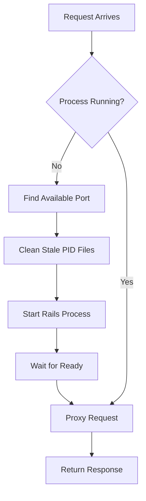

# Process Management

Navigator provides intelligent process management for Rails applications, handling everything from startup to graceful shutdown with automatic resource management.

## How It Works

Navigator manages Rails applications as separate processes, providing:

1. **On-demand startup** - Applications start when first requested
2. **Dynamic port allocation** - Automatically finds available ports
3. **Process pooling** - Reuses processes across requests
4. **Idle timeout** - Stops unused processes to save resources
5. **Graceful shutdown** - Clean termination with proper cleanup

## Process Lifecycle

### Startup Sequence



**Steps:**

1. **Request arrives** for a Rails application
2. **Check if process exists** in the pool
3. **If no process**: Start new Rails process
4. **Port allocation**: Find available port (4000-4099 range)
5. **PID file cleanup**: Remove stale PID files
6. **Process startup**: Start Rails with proper environment
7. **Health check**: Wait for process to be ready
8. **Request proxy**: Forward request to Rails process

### Process States

| State | Description | Behavior |
|-------|-------------|----------|
| **Starting** | Process is being launched | Queue requests until ready |
| **Ready** | Process accepting requests | Normal request forwarding |
| **Busy** | Process handling requests | Continue forwarding |
| **Idle** | Process not handling requests | Start idle timer |
| **Stopping** | Process being terminated | No new requests |
| **Crashed** | Process exited unexpectedly | Start new process |

## Configuration

### Basic Pool Settings

```yaml
pools:
  max_size: 10          # Maximum processes per application
  idle_timeout: 300     # Stop after 5 minutes of inactivity  
  start_port: 4000      # Starting port for allocation
```

### Per-Application Settings

```yaml
applications:
  tenants:
    - name: high-traffic
      path: /api/
      max_processes: 15     # Override global max_size
      idle_timeout: 600     # 10 minutes for this app
      min_instances: 2      # Always keep 2 processes running
      
    - name: low-traffic
      path: /admin/
      max_processes: 3      # Limit resources for admin
      idle_timeout: 60      # Stop quickly when idle
```

### Process Limits

| Setting | Default | Description |
|---------|---------|-------------|
| `max_size` | 10 | Global limit across all applications |
| `max_processes` | Inherits `max_size` | Per-application limit |
| `min_instances` | 0 | Minimum processes to keep running |
| `idle_timeout` | 300 | Seconds before stopping idle process |

## Port Management

### Dynamic Allocation

Navigator automatically finds available ports instead of sequential assignment:

```yaml
pools:
  start_port: 4000  # Start searching from port 4000
  # Navigator tries: 4000, 4001, 4002... until available port found
```

### Port Range

- **Default range**: 4000-4099 (100 ports)
- **Configurable start**: Set `start_port` to change range
- **Automatic detection**: Skips ports already in use
- **Cleanup**: Removes stale processes on ports

### Port Conflict Resolution

```bash
# Navigator handles these scenarios:
# 1. Port in use by other process -> try next port
# 2. Stale PID file exists -> clean up and use port  
# 3. Process crashed -> clean up PID file and restart
# 4. Port range exhausted -> log error and fail
```

## PID File Management

Navigator automatically manages PID files for process tracking:

### PID File Locations

```yaml
applications:
  env:
    PIDFILE: "tmp/pids/${name}.pid"  # Per-application PID files
    
  tenants:
    - name: main
      # PID file: tmp/pids/main.pid
    - name: api  
      # PID file: tmp/pids/api.pid
```

### Automatic Cleanup

Navigator performs PID file cleanup to prevent conflicts:

1. **Before starting**: Remove stale PID files
2. **Process check**: Verify if process in PID file is running
3. **Stale detection**: Remove PID files for dead processes
4. **Clean startup**: Ensure no conflicts before launching

## Error Handling and Recovery

### Process Crashes

When a Rails process crashes, Navigator:

1. **Detects crash** via connection refused error
2. **Cleans up PID file** and process resources  
3. **Starts new process** automatically
4. **Retries request** on the new process

```yaml
# Configure crash recovery
pools:
  max_size: 10
  
# Log crash events  
# Navigator logs: "Process crashed, starting replacement"
```

### Startup Failures

If a Rails process fails to start:

1. **Log error** with detailed information
2. **Clean up resources** (PID files, ports)
3. **Return 502 error** to client
4. **Retry on next request**

### Resource Exhaustion

When process limits are reached:

```yaml
pools:
  max_size: 5  # Only 5 processes allowed
  
# Behavior when limit reached:
# - Queue requests for available processes
# - Return 503 if no processes available
# - Log resource exhaustion warnings
```

## Performance Optimization

### Process Preloading

Keep processes warm to reduce startup latency:

```yaml
applications:
  tenants:
    - name: critical-app
      path: /api/
      min_instances: 2  # Always keep 2 processes ready
      
    - name: background-app  
      path: /background/
      min_instances: 0  # Start on-demand only
```

### Timeout Tuning

Adjust timeouts based on application characteristics:

```yaml
# Fast startup app
- name: simple-api
  idle_timeout: 60    # Stop quickly, starts fast
  
# Slow startup app  
- name: heavy-app
  idle_timeout: 1800  # Keep running longer, slow to start
  
# Critical app
- name: production-app
  min_instances: 3    # Always ready
  idle_timeout: 3600  # 1 hour timeout
```

### Resource Allocation

```yaml
pools:
  max_size: 20        # Total processes across all apps

applications:
  tenants:
    # High-priority app gets more resources
    - name: production
      max_processes: 15
      
    # Low-priority apps share remaining resources  
    - name: staging
      max_processes: 3
    - name: development
      max_processes: 2
```

## Monitoring

### Process Status

Check running processes:

```bash
# See Navigator and Rails processes
ps aux | grep -E '(navigator|rails|ruby)'

# Check specific ports
netstat -tlnp | grep -E '(3000|400[0-9])'

# Monitor Navigator logs
tail -f /var/log/navigator.log | grep -E '(Starting|Stopping) process'
```

### Health Checks

Navigator provides built-in process health monitoring:

```bash
# Check if processes are responding
curl -I http://localhost:3000/your-app-path

# Monitor process starts/stops in logs
grep -E "(Starting|Stopping) process" /var/log/navigator.log
```

### Resource Usage

Monitor resource consumption:

```bash
# Memory usage by Rails processes  
ps aux | grep rails | awk '{sum += $6} END {print "Total Memory: " sum/1024 " MB"}'

# Process count per application
ps aux | grep rails | wc -l

# Port usage
netstat -tlnp | grep -E '400[0-9]' | wc -l
```

## Troubleshooting

### Process Won't Start

1. **Check Rails application**:
   ```bash
   cd /path/to/rails/app
   bundle exec rails server
   ```

2. **Verify environment**:
   ```bash
   # Check environment variables
   env | grep RAILS
   
   # Test database connection
   bundle exec rails dbconsole
   ```

3. **Check permissions**:
   ```bash
   # Navigator needs read/write access
   ls -la /path/to/rails/app
   ls -la tmp/pids/
   ```

### Port Conflicts

1. **Check what's using ports**:
   ```bash
   netstat -tlnp | grep -E '400[0-9]'
   lsof -i :4000
   ```

2. **Change port range**:
   ```yaml
   pools:
     start_port: 5000  # Use different range
   ```

3. **Clean up stale processes**:
   ```bash
   # Kill stale Rails processes
   pkill -f "rails server"
   
   # Remove stale PID files
   rm -f tmp/pids/*.pid
   ```

### High Memory Usage

1. **Reduce process count**:
   ```yaml
   pools:
     max_size: 5  # Reduce from default 10
   ```

2. **Shorter idle timeout**:
   ```yaml
   pools:
     idle_timeout: 120  # 2 minutes instead of 5
   ```

3. **Per-app limits**:
   ```yaml
   applications:
     tenants:
       - name: memory-hungry
         max_processes: 2  # Limit this specific app
   ```

### Slow Response Times

1. **Increase process count**:
   ```yaml
   pools:
     max_size: 20  # More processes for concurrency
   ```

2. **Use process preloading**:
   ```yaml
   applications:
     tenants:
       - name: critical
         min_instances: 3  # Keep processes warm
   ```

3. **Optimize Rails startup**:
   ```ruby
   # config/environments/production.rb
   config.eager_load = true  # Faster subsequent requests
   ```

## Advanced Features

### Custom Process Management

```yaml
applications:
  tenants:
    - name: custom-app
      path: /custom/
      
      # Custom startup command
      command: bundle
      args: [exec, rails, server, -p, "${PORT}"]
      
      # Custom environment
      env:
        CUSTOM_VAR: value
        RAILS_LOG_LEVEL: debug
```

### Process Isolation

```yaml
applications:
  tenants:
    - name: isolated-app
      path: /isolated/
      working_dir: /var/www/isolated-app  # Separate directory
      env:
        RAILS_ENV: production
        DATABASE_URL: postgres://localhost/isolated_db  # Separate DB
```

### Graceful Deployments

```bash
# Deploy without downtime
# 1. Deploy new code
git pull origin main
bundle install
bundle exec rails assets:precompile

# 2. Reload Navigator configuration (optional)
kill -HUP $(cat /tmp/navigator.pid)

# 3. Processes will restart on next request
# Old processes serve existing requests
# New processes start with new code
```

## Integration with System Services

### systemd Integration

```ini title="/etc/systemd/system/navigator.service"
[Unit]
Description=Navigator Rails Server
After=network.target

[Service]
Type=simple
User=rails
WorkingDirectory=/var/www/app
ExecStart=/usr/local/bin/navigator /etc/navigator/navigator.yml
Restart=always
RestartSec=10

# Process management
KillMode=mixed
KillSignal=SIGTERM
TimeoutStopSec=30

[Install]
WantedBy=multi-user.target
```

### Docker Integration

```dockerfile
# Dockerfile
FROM ruby:3.2

# Install Navigator
COPY navigator /usr/local/bin/
COPY navigator.yml /app/

# Rails setup
WORKDIR /app
COPY . .
RUN bundle install

# Navigator manages Rails processes
EXPOSE 3000
CMD ["navigator", "/app/navigator.yml"]
```

## See Also

- [Configuration Overview](../configuration/index.md)
- [Applications Configuration](../configuration/applications.md)
- [Managed Processes](../configuration/processes.md)
- [Examples](../examples/index.md)